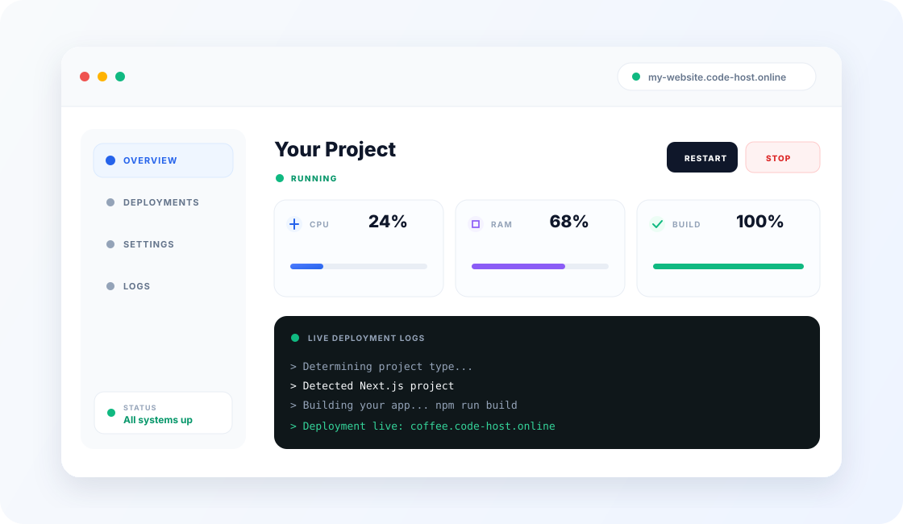

<p align="center">
  
</p>

<h1 align="center">☁️ CodeHost</h1>

<p align="center">
  <strong>A cloud platform built for developers and students.</strong><br />
  Deploy apps, APIs, workers, and databases without managing servers.
</p>

<p align="center">
  <a href="https://code-host.online"></a>
  <a href="https://code-host.online/docs"></a>
  <a href="https://discord.gg/gsh2qpEXT4"></a>
</p>

<p align="center">
  
  
  
</p>

<p align="center">
  <a href="https://code-host.online/docs#dashboard"></a>
</p>

## ✨ What is CodeHost?

> **Ship your code, skip the server chores.** CodeHost is a developer-first PaaS for deploying projects from Git or ZIP uploads. It detects common frameworks, runs projects in isolated containers, and provides managed databases, HTTPS, and prepaid usage.

## 🚀 Platform features

<table>
  <tr>
    <td width="50%"><strong>📦 Deploy your way</strong><br />Connect a GitHub repository or upload a ZIP. Framework detection handles the build.</td>
    <td width="50%"><strong>⚡ Start from a template</strong><br />Launch Next.js, FastAPI, Express, Django, Go, and Flask starters.</td>
  </tr>
  <tr>
    <td><strong>🗄️ Add managed databases</strong><br />Provision PostgreSQL, MySQL, Redis, or MongoDB alongside your app.</td>
    <td><strong>🌙 Save while idle</strong><br />Containers can sleep without traffic and wake when requests return.</td>
  </tr>
  <tr>
    <td><strong>🔒 Go live securely</strong><br />Get a CodeHost subdomain, automatic TLS, and custom domain support.</td>
    <td><strong>💳 Keep spend predictable</strong><br />Prepaid credits and a free tier. See the <a href="https://code-host.online">platform</a> for current plans.</td>
  </tr>
</table>

## 🧰 Built with

|  | Stack |
| --- | --- |
| 🖥️ **Web app** | Next.js 16 · TypeScript · Tailwind CSS |
| 🔌 **API** | Express · TypeScript · Socket.IO |
| 💾 **Data** | PostgreSQL · Prisma · Redis |
| 📦 **Runtime** | Docker · Docker Compose · Nginx |

The platform is organized as a monorepo: `frontend/` contains the Next.js app, `backend/` the API, `billing/` billing services, `database/` the Prisma schema, `packages/` shared modules, and `infra/` deployment configuration.

## 🏠 Self-hosting

The Compose configuration runs the web app and API from published container images. It expects Docker, a configured reverse proxy network, and the environment values described in `infra/.env.example`.

<details>
<summary>🧩 Requirements and first-time setup</summary>

1. Install Docker Engine and the Docker Compose plugin.
2. Clone the repository and enter it:

   ```bash
   git clone https://github.com/Arsh-Pathan/CodeHost.git
   cd CodeHost
   ```

3. Create the environment file and set the required values, including `PUID`, `PGID`, database credentials, and strong JWT secrets:

   ```bash
   cp infra/.env.example infra/.env
   ```

4. Create the external Docker network expected by the Compose configuration (connect your reverse proxy to this network too):

   ```bash
   docker network create proxy
   ```

</details>

<details>
<summary>▶️ Start the services</summary>

Run Compose from the `infra/` directory:

```bash
cd infra
docker compose up -d
```

The deployment uses the published `ghcr.io/arsh-pathan/codehost-api` and `ghcr.io/arsh-pathan/codehost-web` images. Configure the domain and reverse proxy settings in `infra/.env` for your setup. Optional integrations such as OAuth, SMTP, and Razorpay need their own credentials.

</details>

<details>
<summary>🔐 Environment variables and integrations</summary>

Use [`infra/.env.example`](infra/.env.example) as the source of truth. Change the example passwords and JWT secrets before exposing an instance publicly. OAuth providers, SMTP, and Razorpay are optional; fill in their variables only when enabling those integrations.

</details>

## 🛡️ Security

The platform runs customer projects in separate Docker containers with CPU and memory limits. Treat the Docker socket and deployment credentials as privileged: restrict host access and keep secrets out of source control.

## 🤝 Contributing

Bug reports, ideas, and pull requests are welcome. Please open an issue to discuss larger changes before submitting a pull request.

## 📄 License

CodeHost is distributed under the [MIT License](LICENSE).
